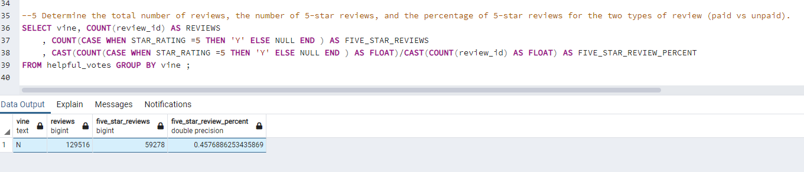
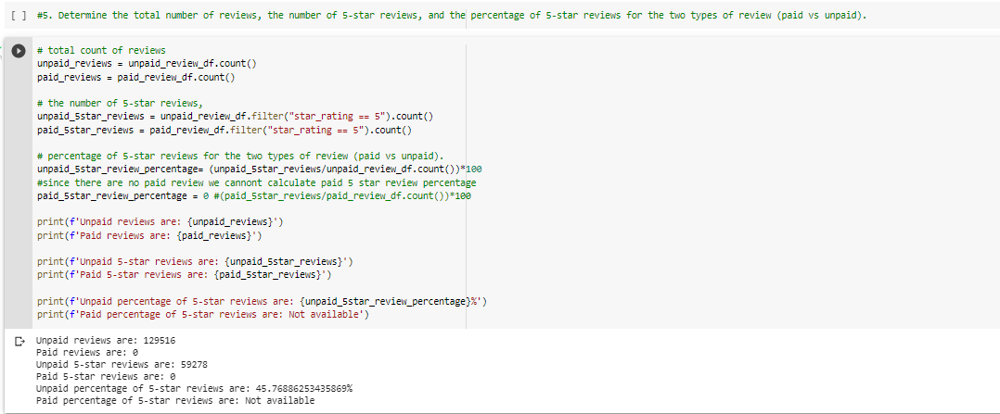
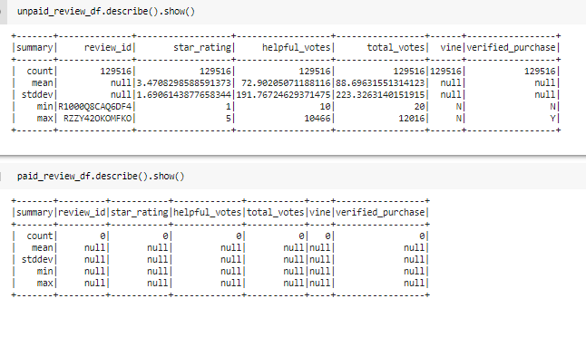

# Amazon_Vine_Analysis
Challenge 16
## Overview of the analysis: 

The goal of this study is to analyze reviews on Amazon that were written by members of the Amazon Vine program, which is a service that allows manufacturers and publishers to receive reviews for their products. To ensure the analysis is valid, only reviews that received a minimum number of votes and had more than 50% helpful votes were considered.

## Results:
Below are the results: 

 

 

- The analysis only included reviews that were not part of the Amazon Vine program, resulting in a total of 129,516 non-vine reviews
- No reviews that were part of the Amazon Vine program were found in the analysis
- Out of the non-vine reviews, 59,278 received a 5-star rating, which represents 45.76% of all non-vine reviews.

## SUMMARY 
Our findings suggest that 5-star reviews are not the most common in paid reviews. This implies that the tendency is for reviews to be more critical. To further confirm this statement, we could use a text analysis technique such as Term Frequency-Inverse Document Frequency Weight on the "review_body" to build a model and determine the overall tendency of the reviews.

 
   
